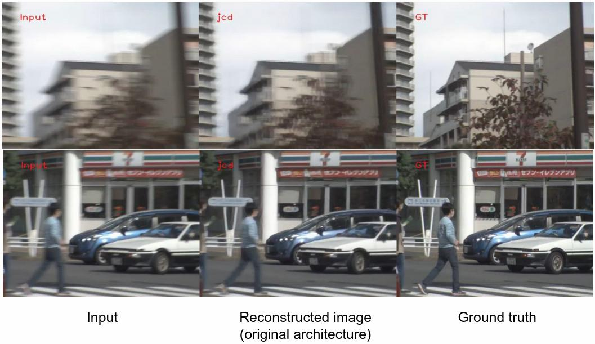

# Rolling to Global shutter transformer 

The repository contains the code implementation of the final project of the Skoltech Deep Learning 2023 course. As a basis, we took the article "Towards Rolling Shutter Correction and Deblurring in Dynamic Scenes". Then we reproduced the results of the original article and changed the architecture of one of the model blocks to achieve better model quality.


### Problem statement 
When shooting fast-moving objects on a camera with a rolling shutter, defects appear in the image that distort the true position of objects.

### Abstract
The idea of our project to transform images captured by rolling shutter cameras to global shutter images . Rolling shutter cameras capture images by scanning a scene over a period of time, resulting in distorted images with motion artifacts. To address this issue, global shutter cameras capture images instantaneously. The goal of the project is to evaluate the appearance of distorted objects and generate an image, as if obtained from a global shutter camera.  
This approach is expected to improve the image quality and reduce the motion artifacts, making it applicable in various fields, including robotics, self driving, and computer vision.

### Datasets

We use BS-RSCD, the first dataset used for real-world RSCD task, using a well-designed beam-splitter acquisition system. A RS camera and a GS camera are physically aligned to capture RS distorted and blurry as well as GS sharp video pairs simultaneously. 
The data samples  was collected using the beam-splitter acquisition system as below:
 

### Example of results

Examples
Here is the result with the original architecture
<p align="center"></p>

Here is the result with the modified architecture
<p align="center"></p>

Here are the metrics:
<p align="center"></p>

## Code usage instructions
### Prerequisites
Install the dependent packages:

```bash
python -m venv .venv
source .venv/bin/activate
sh install.sh
```

Download lmdb files of [BS-RSCD](https://drive.google.com/file/d/1j4gxN28KmDA7Yl1W37i87n3nFIgmZh2_/view?usp=sharing)


### Instructions

###### Notebooks for Collab
The self-explanatory notebook can be found at ```notebooks/Run_experiment_Colab.ipynb``.


## Credits
- [CVPR2021](https://arxiv.org/abs/2104.01601) Towards Rolling Shutter Correction and Deblurring in Dynamic Scenes (CVF Link)
- [Skoltech DL course](https://github.com/oseledets/dl2023) for the great DL course;
- [Weights & Biases](https://wandb.ai) for machine learning developer tools;
